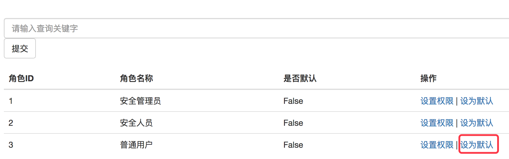
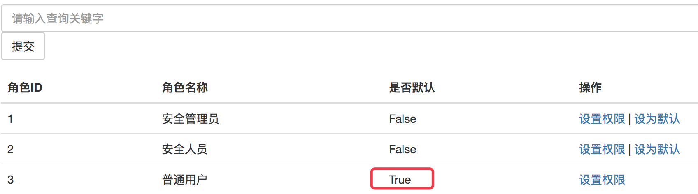

## 说明
> 下面配置在docker容器中进行，进入docker容器命令：

```
# docker exec -it open_source_srcpm bash
# cd srcpm
```

## 数据库初始化详细配置

#### 1. 创建数据库表，添加超级管理员账号,账号为admin@admin.com,密码为11。

```
# python manage.py db init
# python manage.py db migrate
# python manage.py db upgrade

# python manage.py shell
>>> admin = LoginUser(username='admin', email='admin@admin.com', password_hash='pbkdf2:sha1:1000$bLXlzNNn$6f8a286571a361ca99ede2ca3b9163e346f8a3ca', role_name=u'\u8d85\u7ea7\u7ba1\u7406\u5458', confirmed=1)
>>> db.session.add(admin)
>>> db.session.commit()
>>> exit()
```

#### 2. 启动应用

```
# python manage.py runserver -h 0.0.0.0
```

#### 3. 使用超级管理员账号登录，并设置角色

角色分为：
* 安全管理员
* 安全人员
* 普通用户

增加角色页面URL：
http://127.0.0.1:9000/srcpm/admin/role_add


并将【普通用户】设置为默认角色。






#### 4. 设置不同角色的权限

不同角色的详细权限请见：

[漏洞管理平台权限分配一览表.md](permissions.md)

角色权限修改方法为：选择角色对应的所有权限之后提交。


