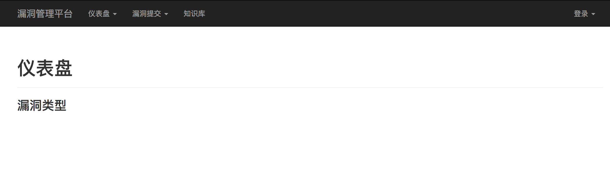
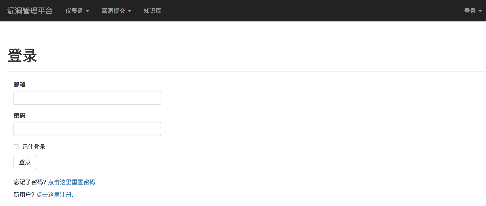

## 部署和启动mysql

```
docker pull mysql

docker run -d -p 127.0.0.1:6606:3306 \
--name open_source_mysqldb \
-e MYSQL_ROOT_PASSWORD=root \
mysql
```

## 创建数据库和账号权限配置

```
$ mysql -h 127.0.0.1 -P 6606 -u root -p
Enter password:root

mysql> CREATE DATABASE IF NOT EXISTS vuldb DEFAULT CHARSET utf8 COLLATE utf8_general_ci;
mysql> grant all on vuldb.* to vuluser@'%' identified by 'vulpassword';
mysql> flush privileges;
mysql> quit
```

## 部署和启动APP

#### 1. 下载源码

```
$ git clone -b open-source https://git.oschina.net/null_451_3666/vulpm.git
```

#### 2. 修改vulpm/srcpm/config.py 配置文件

* 修改公司邮箱后缀
```
    #公司邮箱后缀限制，只能使用公司邮箱注册账号。
    CORP_MAIL = '@qq.com'
```

* 修改邮件CC抄送列表
```
#平台发送的每封邮件的邮件抄送列表，可以设置发送给安全部邮箱列表，可自行修改，也可以保持不变为空
    '''
    示例：
    CC_EMAIL = ['xxx1@creditease.cn',
                'xxx2@creditease.cn',
            ]
    '''
    CC_EMAIL = [
            ]
```

* 修改开发模式的邮箱服务器和发件邮箱配置
```
# 以开发模式的配置运行，使用测试邮件服务器，并开启debug模式

    # 平台发邮件账号设置
    SRCPM_MAIL_SENDER = '安全部 <sec_creditease@sina.com>'
    
    # 发送邮件的服务器设置，邮箱密码由系统变量中读取
    MAIL_SERVER = 'smtp.sina.com'
    MAIL_PORT = 587
    MAIL_USE_TLS = True
    MAIL_USERNAME = os.environ.get(
        'MAIL_USERNAME') or 'sec_creditease@sina.com'
    MAIL_PASSWORD = os.environ.get('MAIL_PASSWORD') or ''
```

* 修改生产模式的邮箱服务器和发件邮箱配置
```
# 以生产模式的配置运行，使用生产邮件服务器，并关闭debug模式

    # 平台发邮件账号设置
    SRCPM_MAIL_SENDER = '安全部 <xxx@creditease.cn>'
    
    # 发送邮件的服务器设置，账号密码由系统变量中读取
    MAIL_SERVER = 'x.x.x.x'
    MAIL_PORT = 25
    MAIL_USE_TLS = False
    MAIL_USERNAME = os.environ.get(
        'MAIL_USERNAME') or 'xxx@creditease.cn'
    MAIL_PASSWORD = os.environ.get('MAIL_PASSWORD') or ''
```

#### 3. 修改定时周期邮件 mail_sender.py 的配置

```
    #平台发送的每封邮件的邮件抄送列表，可以设置发送给安全部邮箱列表，可自行修改，也可以保持不变为空
    '''
    示例：
    CC_EMAIL = ['xxx1@creditease.cn',
                'xxx2@creditease.cn',
            ]
    '''
    CC_EMAIL = [
            ]


    #主机名设置
    SERVER_NAME = 'xxx.creditease.corp'
    
    # 平台发邮件账号设置
    SRCPM_MAIL_SENDER = '安全部 <xxx@creditease.cn>'
    
    
    # 发送邮件的服务器设置，账号密码由系统变量中读取
    MAIL_SERVER = 'x.x.x.x'
    MAIL_PORT = 25
    MAIL_USE_TLS = False
    MAIL_USERNAME = os.environ.get(
        'MAIL_USERNAME') or 'xxx@creditease.cn'
    MAIL_PASSWORD = os.environ.get('MAIL_PASSWORD') or ''
```

#### 4. 修改vulpm/srcpm/app/src/forms.py 漏洞来源下拉列表

```
    ''' 下拉选项 '''
    source_choices = [('',''), (u'安全部', u'安全部'), (u'YISRC', u'YISRC'), (u'公众平台', u'公众平台'), (u'合作伙伴', u'合作伙伴')]
```

#### 5. 在项目根目录下部署和启动APP

```
# 拉取镜像
docker pull daocloud.io/liusheng/vulpm_docker:latest
或
自己构建镜像
docker build -t='vulpm_docker' .

# 启动容器，MAIL_PASSOWRD替换为自己邮箱服务器的密码。
$ docker run -d -p 127.0.0.1:9000:5000 \
--link open_source_mysqldb:db \
--name open_source_srcpm \
-v $PWD/vulpm/srcpm:/opt/webapp/srcpm \
-e DEV_DATABASE_URL='mysql://vuluser:vulpassword@db/vuldb' \
-e SrcPM_CONFIG=development \
-e MAIL_PASSWORD='xxxxxx' \
daocloud.io/liusheng/vulpm_docker:latest \
sh -c 'supervisord -c srcpm/supervisor.conf && supervisorctl -c srcpm/supervisor.conf start all && tail -f srcpm/log/gunicorn.err && tail -f srcpm/log/mail_sender.err'
```

## 初始化数据库

数据库初始化详细配置请见：

[数据库初始化详细配置指南](db_init.md)

或者

直接导入初始化的sql

> 导入sql

```
$ mysql -h127.0.0.1 -P6606 -uroot -p vuldb < vulpm/srcpm/vuldb_init.sql
Enter password:root
```

## 访问洞察

#### 1. 主页

[http://127.0.0.1:9000/srcpm/](http://127.0.0.1:9000/srcpm/)



#### 2. 登录页面

[http://127.0.0.1:9000/srcpm/auth/login](http://127.0.0.1:9000/srcpm/auth/login)

账号|密码
------|------
admin@admin.com|11


