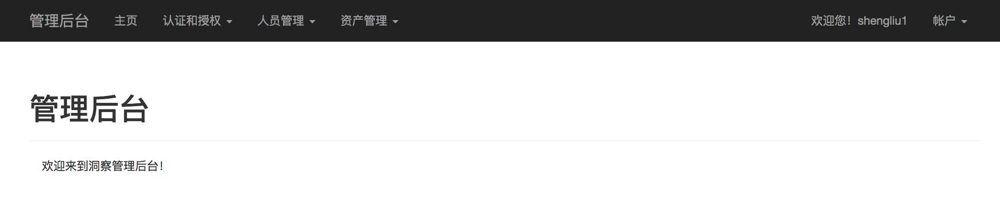
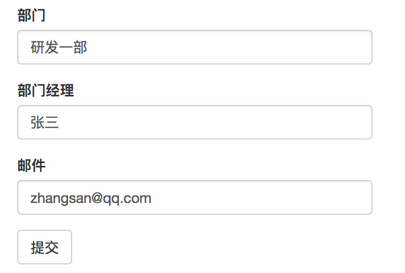
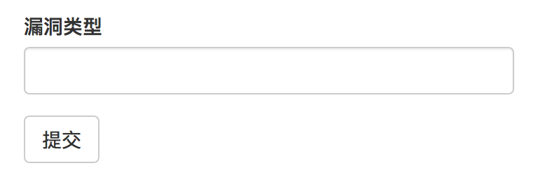

## 使用超级管理员账号登录

[http://127.0.0.1:9000/srcpm/auth/login](http://127.0.0.1:9000/srcpm/auth/login)

|账号|密码|
|------|------|
|admin@admin.com|11|

## 管理后台菜单

管理后台访问地址：

[http://127.0.0.1:9000/srcpm/admin](http://127.0.0.1:9000/srcpm/admin)

管理后台界面：

##### 管理后台功能菜单

认证和授权
* 角色增加
* 角色查看
* 用户查看

人员管理
* 部门增加
* 部门查看

资产管理
* 资产增加
* 资产查看
* 漏洞类型增加
* 漏洞类型查看

## 超级管理员分配角色权限

数据库初始化时已创建完成角色和权限，详细请见:

[数据库初始化详细配置指南](db_init.md)

[漏洞管理平台权限分配一览表](permissions.md)

## 部门增加

部门信息用于添加资产时，选择资产归属部门。

部门信息添加字段：
* 部门：填写部门名称
* 部门经理：填写部门经理姓名
* 邮件：填写部门经理邮箱地址

## 资产增加

资产信息用于漏洞提交时，选择漏洞归属域名资产。

资产信息添加字段：
* 系统名称：系统中文名称
* 系统域名：系统访问域名
* 备用域名：如果有多个域名可填写
* Web Or Interface：Web界面 or 接口
* Is HTTP?：是否HTTP服务
* Is HTTPS?：是否HTTPS服务
* 内外网：内网应用 or 外网应用
* 重要等级：其它部门评定的应用系统重要级别
* 业务线：归属业务线
* 部门：归属部门
* 负责人：填写邮箱，多个负责人邮箱使用;隔开
* 安全官：安全部门负责该系统的安全人员邮箱
* 状态：上线前、线上或下线
* 敏感数据说明：系统中存储的敏感字段说明
* 敏感数据条数：敏感数据条数的数量级
* 允许宕机时长：容忍的宕机时间级别
* 安全重要等级：根据上述3项评定的安全重要等级
* 说明：其它备注

## 漏洞类型增加

漏洞类型用于漏洞提交时，选择漏洞所属的漏洞类型。

## 用户角色修改

用户角色修改经常用于注册普通用户的权限提升，超级管理员通过【管理后台】-【认证和授权】-【用户查看】菜单，搜索用户名找到对应用户，点击该用户条目的【设置角色】超链接，进入用户角色修改页面。

